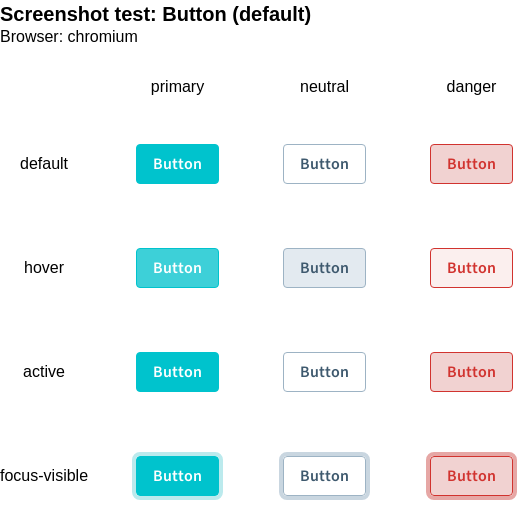

<script lang="ts" setup>
import packageJson from "../../../../../packages/playwright-utils/package.json";
</script>

# @sit-onyx/playwright-utils

<div class="hide-external-link">

[](https://www.npmjs.com/package/@sit-onyx/playwright-utils)

</div>

{{ packageJson.description }}.

## Changelog

A full changelog can be found [here](/development/packages/changelogs/playwright-utils).

## Installation

Install the npm package with your corresponding package manager:

::: code-group

```sh [pnpm]
pnpm add -D @sit-onyx/playwright-utils
```

```sh [npm]
npm install -D @sit-onyx/playwright-utils
```

```sh [yarn]
yarn install -D @sit-onyx/playwright-utils
```

:::

## Utilities

### useMatrixScreenshotTest

Creates a screenshot utility that can be used to capture matrix screenshots.
Useful for capturing a single screenshot/image that contains multiple variants of a component.

#### Example



#### Usage

If not already installed, make sure to install the required dependencies:

::: code-group

```sh [pnpm]
pnpm add -D @playwright/test @playwright/experimental-ct-vue
```

```sh [npm]
npm install -D @playwright/test @playwright/experimental-ct-vue
```

```sh [yarn]
yarn install -D @playwright/test @playwright/experimental-ct-vue
```

:::

##### Step 1: Create matrix screenshot utility

First, we need to create the matrix screenshot test utility like shown below. There you can pass global options that are applied to all matrix screenshot tests.

::: code-group

```ts [playwright.ts]
import { useMatrixScreenshotTest } from "@sit-onyx/playwright-utils";

export const { executeMatrixScreenshotTest } = useMatrixScreenshotTest({
  // optionally provide global/default options
});
```

:::

##### Step 2: Capture matrix screenshots

Afterwards, you can capture a single matrix screenshot like this:

::: code-group

```tsx [MyComponent.tsx]
import { executeMatrixScreenshotTest } from "./playwright";
import { test } from "@playwright/experimental-ct-vue";

test.describe("Screenshot tests", () => {
  executeMatrixScreenshotTest({
    name: "Button (default)",
    columns: ["primary", "neutral", "danger"],
    rows: ["default", "hover", "active", "focus-visible"],
    component: (column) => {
      return <OnyxButton label="Button" color={column} />;
    },
    hooks: {
      beforeEach: async (component, page, column, row) => {
        if (row === "hover") await component.hover();
        if (row === "focus-visible") await page.keyboard.press("Tab");
        if (row === "active") await page.mouse.down();
      },
    },
  });
});
```

:::

<br>

#### Perform accessibility tests <Badge text="optional" type="warning" />

The matrix screenshot utility integrates nicely with features like [accessibility testing](https://playwright.dev/docs/accessibility-testing).

To perform accessibility tests for all individual screenshots (column/row combinations), set it up like described below.

##### Step 1: Install axe-core

::: code-group

```sh [pnpm]
pnpm add -D @axe-core/playwright
```

```sh [npm]
npm install -D @axe-core/playwright
```

```sh [yarn]
yarn install -D @axe-core/playwright
```

:::

##### Step 2: Setup global hook

We can now set up a global hook when calling `useMatrixScreenshotTest()` (see [Create matrix screenshot utility](#step-1-create-matrix-screenshot-utility)) that will run the accessibility test after every screenshot.

Therefore, update your already existing setup like so:

::: code-group

```ts [playwright.ts]
import { useMatrixScreenshotTest } from "@sit-onyx/playwright-utils";

/**
 * Creates an `AxeBuilder` with common configuration that should be used for accessibility tests.
 *
 * @see https://playwright.dev/docs/accessibility-testing#creating-a-fixture
 */
export const createAxeBuilder = (page: Page) => {
  return new AxeBuilder({ page }).withTags(["wcag2a", "wcag2aa", "wcag21a", "wcag21aa"]);
};

export const { executeMatrixScreenshotTest } = useMatrixScreenshotTest<MatrixScreenshotHookContext>(
  {
    defaults: {
      hooks: {
        afterEach: async (component, page, column, row) => {
          // ARRANGE (execute accessibility tests)
          const axeBuilder = createAxeBuilder(page);
          const accessibilityScanResults = await axeBuilder.analyze();

          // ASSERT
          expect(
            accessibilityScanResults.violations,
            `should pass accessibility checks for ${column} ${row}`,
          ).toEqual([]);
        },
      },
    },
  },
);
```

:::

That's it. The accessibility tests will now be performed for every single screenshot.

##### Step 3: Disable rules for individual tests <Badge text="optional" type="warning" />

Sometimes, it might be necessary to disable certain accessibility rules for an individual test.
We can easily support this by making use of the `context` argument that is passed to the `afterEach` hook.

Adjust your global configuration like this to support disabling accessibility rules.

::: code-group

```ts [playwright.ts]
import { useMatrixScreenshotTest } from "@sit-onyx/playwright-utils";

export type MatrixScreenshotHookContext = {
  /**
   * Rules to disable when performing the accessibility tests.
   * **IMPORTANT**: Should be avoided! If used, please include a comment why it is needed.
   *
   * @see https://playwright.dev/docs/accessibility-testing#disabling-individual-scan-rules
   */
  disabledAccessibilityRules?: string[];
};

export const { executeMatrixScreenshotTest } = useMatrixScreenshotTest<MatrixScreenshotHookContext>(
  {
    defaults: {
      hooks: {
        afterEach: async (component, page, column, row, context) => {
          // ARRANGE (execute accessibility tests)
          const axeBuilder = createAxeBuilder(page);

          if (context?.disabledAccessibilityRules?.length) {
            axeBuilder.disableRules(
              DEFAULT_DISABLED_AXE_RULES.concat(context.disabledAccessibilityRules),
            );
          }

          const accessibilityScanResults = await axeBuilder.analyze();
          // ...
        },
      },
    },
  },
);
```

:::

For each individual test, you can now optionally disable rules by defining them in the `context`:

::: code-group

```tsx [MyComponent.tsx]
import { executeMatrixScreenshotTest } from "./playwright";
import { test } from "@playwright/experimental-ct-vue";

test.describe("Screenshot tests", () => {
  executeMatrixScreenshotTest({
    name: "Button (default)",
    context: {
      disabledAccessibilityRules: ["color-contrast"],
    },
    // ...
  });
});
```

:::

### adjustSizeToAbsolutePosition

Sets the component size to fit all absolute positioned content so it is fully included in screenshots.
Useful if component includes flyouts or popovers that use CSS `position: absolute`.

```tsx
import { adjustSizeToAbsolutePosition } from "@sit-onyx/playwright-utils";
import { test, expect } from "@playwright/experimental-ct-vue";
import MyComponent from "./MyComponent.vue";

test("my example test", async ({ mount }) => {
  const component = await mount(<MyComponent />);

  // open/show absolute positioned content, e.g. a tooltip
  await component.getByRole("tooltip").click();

  // adjust component size to include tooltip so its shown/included in the screenshot
  await adjustSizeToAbsolutePosition(component);

  await expect(component).toHaveScreenshot("screenshot.png");
});
```
