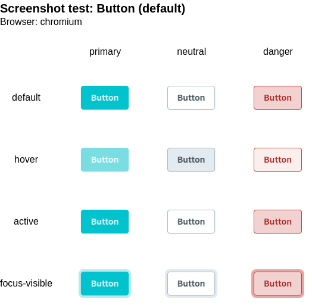

<script lang="ts" setup>
import packageJson from "../../../../../packages/playwright-utils/package.json";
</script>

# @sit-onyx/playwright-utils

<div class="hide-external-link">

[](https://www.npmjs.com/package/@sit-onyx/playwright-utils)

</div>

{{ packageJson.description }}.

## Changelog

A full changelog can be found [here](/development/packages/changelogs/playwright-utils).

## Installation

Install the npm package with your corresponding package manager:

::: code-group

```sh [pnpm]
pnpm add -D @sit-onyx/playwright-utils@beta
```

```sh [npm]
npm install -D @sit-onyx/playwright-utils@beta
```

```sh [yarn]
yarn install -D @sit-onyx/playwright-utils@beta
```

:::

## Utilities

### useMatrixScreenshotTest

Creates a screenshot utility that can be used to capture matrix screenshots.
Useful for capturing a single screenshot/image that contains multiple variants of a component.

Will also perform axe accessibility tests.

#### Example



#### Usage

If not already installed, make sure to install the required dependencies:

::: code-group

```sh [pnpm]
pnpm add -D @playwright/test @playwright/experimental-ct-vue @axe-core/playwright
```

```sh [npm]
npm install -D @playwright/test @playwright/experimental-ct-vue @axe-core/playwright
```

```sh [yarn]
yarn install -D @playwright/test @playwright/experimental-ct-vue @axe-core/playwright
```

:::

##### Step 1: Create axe accessibility fixture

The matrix screenshot utility will also perform axe accessibility tests for all component variants.
For this, you need to create and configure the `AxeBuilder` for your project first.

See the [Playwright docs](https://playwright.dev/docs/accessibility-testing#creating-a-fixture) for further information.

::: code-group

```ts [axe-test.ts]
import { test as base } from "@playwright/experimental-ct-vue";
import AxeBuilder from "@axe-core/playwright";

export { expect } from "@playwright/experimental-ct-vue";

type AxeFixture = {
  makeAxeBuilder: () => AxeBuilder;
};

/**
 * Extends Playwright's base test by providing `makeAxeBuilder`
 * This new `test` can be used in multiple test files, and each of them will get
 * a consistently configured AxeBuilder instance.
 *
 * @see https://playwright.dev/docs/accessibility-testing#using-a-test-fixture-for-common-axe-configuration
 */
export const test = base.extend<AxeFixture>({
  makeAxeBuilder: async ({ page }, use, testInfo) => {
    const makeAxeBuilder = () => {
      return new AxeBuilder({ page }).withTags(["wcag2a", "wcag2aa", "wcag21a", "wcag21aa"]);
    };

    await use(makeAxeBuilder);
  },
});
```

:::

##### Step 2: Create matrix screenshot utility

Now we can create the matrix screenshot test function like shown below. There you can pass global options that are applied to all matrix screenshot tests.

Make sure to pass the `test` and `expect` functions created in step 1 so the `AxeBuilder` is available.

::: code-group

```ts [playwright.ts]
import { useMatrixScreenshotTest } from "@sit-onyx/playwright-utils";
import { expect, test } from "./axe-test";

export const { executeMatrixScreenshotTest } = useMatrixScreenshotTest({ expect, test });
```

:::

##### Step 3: Create matrix screenshots

Afterwards, you can execute a single matrix screenshot like this:

::: code-group

```tsx [MyComponent.tsx]
import { executeMatrixScreenshotTest } from "./playwright";
import { test } from "./axe-test";

test.describe("Screenshot tests", () => {
  executeMatrixScreenshotTest({
    name: "Button (default)",
    columns: ["primary", "neutral", "danger"],
    rows: ["default", "hover", "active", "focus-visible"],
    component: (column) => {
      return <OnyxButton label="Button" color={column} />;
    },
    beforeScreenshot: async (component, page, column, row) => {
      if (row === "hover") await component.hover();
      if (row === "focus-visible") await page.keyboard.press("Tab");
      if (row === "active") await page.mouse.down();
    },
  });
});
```

:::

### adjustAbsolutePositionScreenshot

Sets the component size to fit all absolute positioned content so it is fully included in screenshots.
Useful if component includes flyouts etc. that use CSS `position: absolute`.

```tsx
import { adjustAbsolutePositionScreenshot } from "@sit-onyx/playwright-utils";
import { test, expect } from "@playwright/experimental-ct-vue";
import MyComponent from "./MyComponent.vue";

test("my example test", async ({ mount }) => {
  const component = await mount(<MyComponent />);

  // open/show absolute positioned content, e.g. a tooltip
  await component.getByRole("tooltip").click();

  // adjust component size to include tooltip so its shown/included in the screenshot
  await adjustAbsolutePositionScreenshot(expect, component);

  await expect(component).toHaveScreenshot("screenshot.png");
});
```
