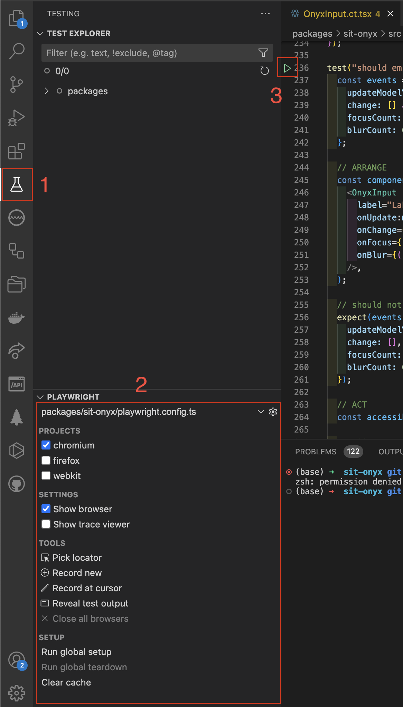

<script lang="ts" setup>
import { packageManager } from "../../../../package.json";
import nodeVersion from "../../../../.node-version?raw";
</script>

# Contribution Guide

When contributing to onyx, please respect the [Schwarz IT Code of Conduct](https://github.com/SchwarzIT/.github/blob/main/CODE_OF_CONDUCT.md) and our [technical vision/guidelines](/principles/technical-vision).

::: info Target audience
This document is directed at people that are developing **for** onyx.
It gives tips and guidelines on what should or must be considered when working with onyx.
:::

## Prerequisites / Technical setup

1. Install [Node.js](https://nodejs.org/en) version **{{ nodeVersion }}**. <br />
   We recommend using [fnm](https://github.com/Schniz/fnm) for managing your node versions which will automatically use the correct node version when working in the onyx repo.

2. Install the [pnpm](https://pnpm.io/) package manager with a compatible version to `^{{ packageManager.replace("pnpm@", "") }}`

## Recommended IDE Setup

We follow the official Vue recommendation for IDE setup which is [VSCode](https://code.visualstudio.com) with the [Vue - Official](https://marketplace.visualstudio.com/items?itemName=Vue.volar) extension.

## Set up the monorepo

In order to work in the onyx monorepo, you need to install the dependencies by running:

```sh
pnpm install
```

## Package scripts

Depending on which package you want to contribute, there are different scripts available. A full list can be found in the `package.json` file of the corresponding package.
Here is a list of the most commonly used scripts.

::: code-group

```sh [Monorepo root]
pnpm install # install all dependencies
pnpm lint:fix:all # lint and fix all packages
pnpm format:all # format all files
```

```sh [packages/sit-onyx]
pnpm dev # run Storybook in dev mode when developing components
pnpm build # build all onyx components
pnpm test # run unit tests
pnpm test:components # run Playwright component tests
```

```sh [apps/docs]
pnpm dev # run docs in dev mode
```

:::

## Creating a Pull Request

Pull Requests are very welcome!
Please consider our [technical guidelines](/principles/technical-vision) when contributing to onyx.

1. [Create a fork](https://github.com/SchwarzIT/onyx/fork) to commit and push your changes to
2. When your changes affect the user and need to be released, [add a changeset](https://github.com/SchwarzIT/onyx/blob/main/.changeset/README.md).
3. Then [create a PR](https://github.com/SchwarzIT/onyx/compare) to merge your changes back into our repository.

When your PR gets approved, you can expect a pre-release immediately after it is merged. Production releases are planned to be published every 2 weeks after the release of version 1.0.0.

::: tip Screenshot tests
Component screenshot tests using Playwright will only be performed in our [GitHub workflows](https://github.com/SchwarzIT/onyx/actions) to ensure consistency of the resulting images which vary on different operating systems.

If you made visual changes to components, you can use [this Workflow](https://github.com/SchwarzIT/onyx/actions/workflows/playwright-screenshots.yml) to update the screenshots on your branch.
:::

## Developing Components

Below is the basic code for a new onyx component.
For more information about the density feature of onyx, visit our [density docs](/development/density).

::: code-group

```vue [OnyxMyComponent.vue]
<script lang="ts" setup>
import type { OnyxMyComponentProps } from "./types";
import { useDensity } from "../../composables/density";

const props = defineProps<OnyxMyComponentProps>();

const { densityClass } = useDensity(props);
</script>

<template>
  <div :class="['onyx-my-component', densityClass]">
    <!-- component HTML -->
  </div>
</template>

<style lang="scss">
@use "../../styles/mixins/layers.scss";

.onyx-my-component {
  @include layers.component() {
    // component styles...
  }
}
</style>
```

```ts [types.ts]
import type { DensityProp } from "../../styles/density";

export type OnyxMyComponentProps = DensityProp & {
  // component props...
};
```

:::

### Include CSS Layers

As you can see in the code snippet above, we make use of [Cascade Layers](https://developer.mozilla.org/en-US/docs/Learn/CSS/Building_blocks/Cascade_layers) to simplify how different style sources cascade.
By putting all our styles into layers they can also be easily overwritten by users.

Therefore, you must make use of the `@include layers.component()` mixin as shown above.
This will also normalize styles for this class and it's children. The scoped rules will be applied in the `onyx.component` layer.

### Custom density styles

For most cases, the [CSS variables for densities](/tokens/spacings) will already support that the component adjusts based on the current density.
In exceptional cases it might be required to apply special styles for the densities which can not be covered with this.

You can use our density mixin in this case:

```vue
<style lang="scss">
@use "../../styles/mixins/density.scss";

.onyx-my-component {
  @include density.compact {
    --onyx-my-component-padding: var(--onyx-spacing-sm);
  }

  @include density.default {
    --onyx-my-component-padding: var(--onyx-spacing-md);
  }

  @include density.cozy {
    --onyx-my-component-padding: var(--onyx-spacing-lg);
  }

  @include layers.component() {
    padding: var(--onyx-my-component-padding);
  }
}
</style>
```

### Testing

We require every component to be thoroughly tested.
This project uses [Playwright](https://playwright.dev/) and [Vitest](https://vitest.dev/) for testing.

#### Component (UI) tests

Generally [playwright component tests](https://playwright.dev/docs/test-components) (kept in `.ct.tsx`-files) suffice to test a component.

Component tests must include screenshot tests to ensure that any style changes happen intentionally and can be approved by our UX.
To easily generate and test screenshots for all main component states the `executeMatrixScreenshotTest` (in file `/packages/sit-onyx/src/playwright/screenshots.tsx`) utility is to be used.

In our monorepo playwright/component tests are run non-interactively using the `pnpm test:components` script.

To use Playwright interactively run `pnpm dlx playwright test --ui` (add the `--headed` flag to open the test browsers) in the package directory.

#### CI

To investigate failing playwright tests from the CI locally:

1. Download the `html-report--attempt-x` artifact **_after_** the pipeline has finished.
2. Unzip the archive
3. `cd` into the package you want to see the report for
4. Run `pnpm dlx playwright show-report`

##### VSCode

We recommend the [Playwright Test for VSCode](https://marketplace.visualstudio.com/items?itemName=ms-playwright.playwright) extension for running component tests in development.
It allows to build and run specific tests interactively out of the IDE (see annotation `3` in screenshot beneath).
If you encounter any issues please make sure

- to run the `pnpm build` script at least once for the pacakge
- to only select the playwright config file for the current package your are testing
- to run `Run global teardown`, `Close All Browsers` and `Clear Cache`

You find the playwright VSCode extension settings (see annotation `2` in screenshot beneath) in the `Testing` section of VSCode (annotation `1`).



#### Unit tests

For self-contained logic, excluding Vue components, unit tests (kept in `.spec.ts`-files) can be written using [Vitest](https://vitest.dev/).

In our monorepo unit tests are run using the `pnpm test` script.
