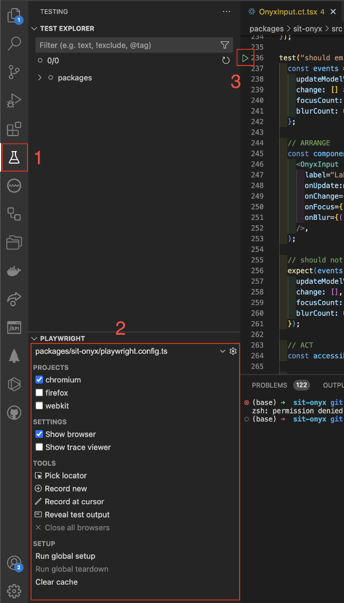

# Testing

We require every component to be thoroughly tested.
**onyx** uses [Playwright](https://playwright.dev/) and [Vitest](https://vitest.dev/) for testing.

## Component tests

Generally [playwright component tests](https://playwright.dev/docs/test-components) (kept in `.ct.tsx`-files) suffice to test a component.

Component tests must include screenshot tests to ensure that any style changes happen intentionally and can be approved by our UX.
To easily generate and test screenshots for all main states the `executeMatrixScreenshotTest` utility is to be used.

<<< ./testing-example.ct.tsx#executeMatrixScreenshotTest

The utility creates a screenshot for every combination of `rows` and `columns`.
These are then combined in into grid and saves a single screenshot of it.
Here is an example for the OnyxButton:

::: warning
Choose the columns and rows carefully, as the number of combination grows quadratically. It might be preferable to create a new screenshot matrix instead of adding more columns/rows.
:::

Accessibility tests (using [axe-core](https://github.com/dequelabs/axe-core)) are also run for every combination.

For standalone tests or more complicated setups, [`toHaveScreenshot`](https://playwright.dev/docs/test-snapshots) can be used directly:

<<< ./testing-example.ct.tsx#toHaveScreenshot

### Development

In our monorepo component tests are run non-interactively using the `pnpm test:components` script.

To use Playwright interactively run `pnpm exec playwright test --ui` (add the `--headed` flag to open the see the- browsers) in the package directory.

### CI

To investigate failing playwright tests from the CI locally:
You can run `pnpm gh:show-report` in the root, which will

1. Download the `html-report--attempt-x` artifact **_after_** the pipeline has finished.
2. Unzip the archive
3. `cd` into the package you want to see the report for
4. Run `pnpm dlx playwright show-report`

### VSCode

We highly recommend to use the [Playwright Test for VSCode](https://marketplace.visualstudio.com/items?itemName=ms-playwright.playwright) extension for running component tests in development.
It allows to build and run specific tests interactively, directly from the IDE (see annotation `3` in screenshot beneath).
If you encounter any issues please make sure

- to run the `pnpm build` script at least once for the package
- to only select the playwright config file for the current package your are testing
- to run `Run global teardown`, `Close All Browsers` and `Clear Cache`

You find the playwright VSCode extension settings (see annotation `2` in screenshot beneath) in the `Testing` section of VSCode (annotation `1`).

## Unit tests

For self-contained logic, excluding Vue components, unit tests (kept in `.spec.ts`-files) can be written using [Vitest](https://vitest.dev/).

In our monorepo unit tests are run using the `pnpm test` script.
